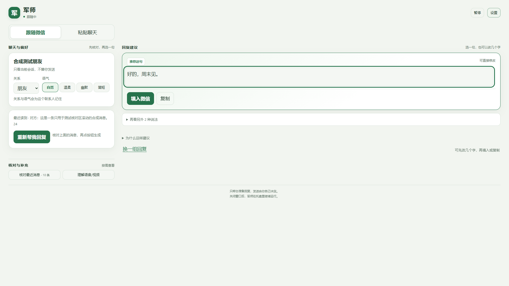
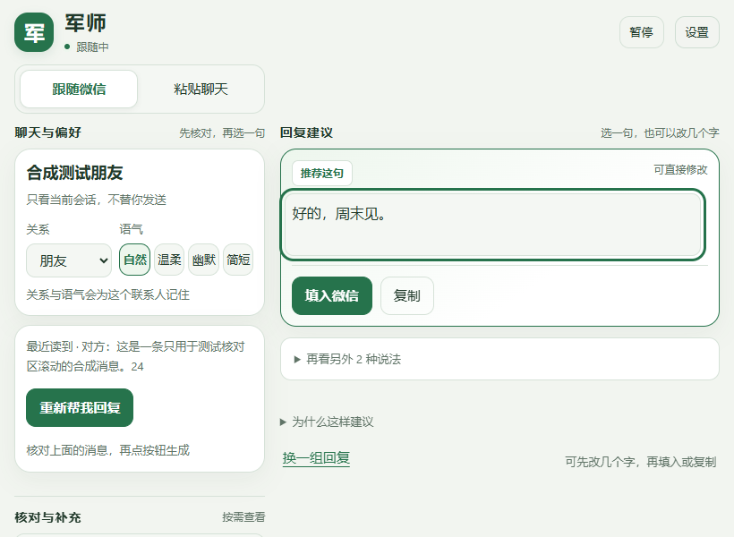

# 军师 1.5.69

## 使用

打开桌面军师并展开微信会话；如果显示已暂停，点顶部“开始”。也可选择“粘贴聊天”。核对建议后复制或手动填入，发送由你本人完成。自动填入已移除。

## 窗口排版

- 主区随窗口宽度展开，左右留白随宽度调整。
- 大于 760 像素宽时，偏好与回复左右分栏；窄窗口上下排列，核对工具跟在回复之后。
- 回复编辑区高度随窗口高度调整；长内容可在编辑区滚动，短窗口缩小留白。
- 调整窗口不会重建草稿或触发分析，已编辑的回复、粘贴内容与光标保留。
- 设置标题与关闭按钮在长设置滚动时保持可用；消息核对抽屉保留内部滚动、焦点保护与 Escape 关闭。
- 浅色、深色与大字设置保留。

## 已有优化同步

仓库同时同步了本机 1.5.68 已核验的语境、表情、事实边界、缓存与设置保存改进，以及表情名称字典和 Unicode 许可。保留仓库已有的启动诊断、端口变化恢复和 SDK 文档。
没有上传密钥、私人配置、聊天记录、运行时或模型权重。

## 验证

自适应检查使用虚构会话和模拟服务，覆盖大、中、窄、短窗口及连续缩放，不调用真实模型或操作微信。测试方式见根目录 README；本版本251项自适应检查、15项交互回归、76项排版回归全部通过；另有3项旧问题复现。明细见 [自适应报告](qa/responsive-1.5.69.json)、[交互报告](qa/final-ui-test-results.json)、[排版报告](qa/visual-ux-test-results.json)。
1.5.68 已有 523 项有效离线检查与 13 个虚构场景真实模型检查，这些结果是已有行为的证据，并非长期真实聊天准确率。
陌生表情、反话和模糊图片仍可能理解错，证据不足时保留未知并允许更正。

本目录较早的“使用说明”“已知限制”“真实测试报告”等文件是历史记录，其中的版本与自动填入说明请以本页和根目录 README 为准。

## 界面预览

以下是虚构会话的验证画面。

